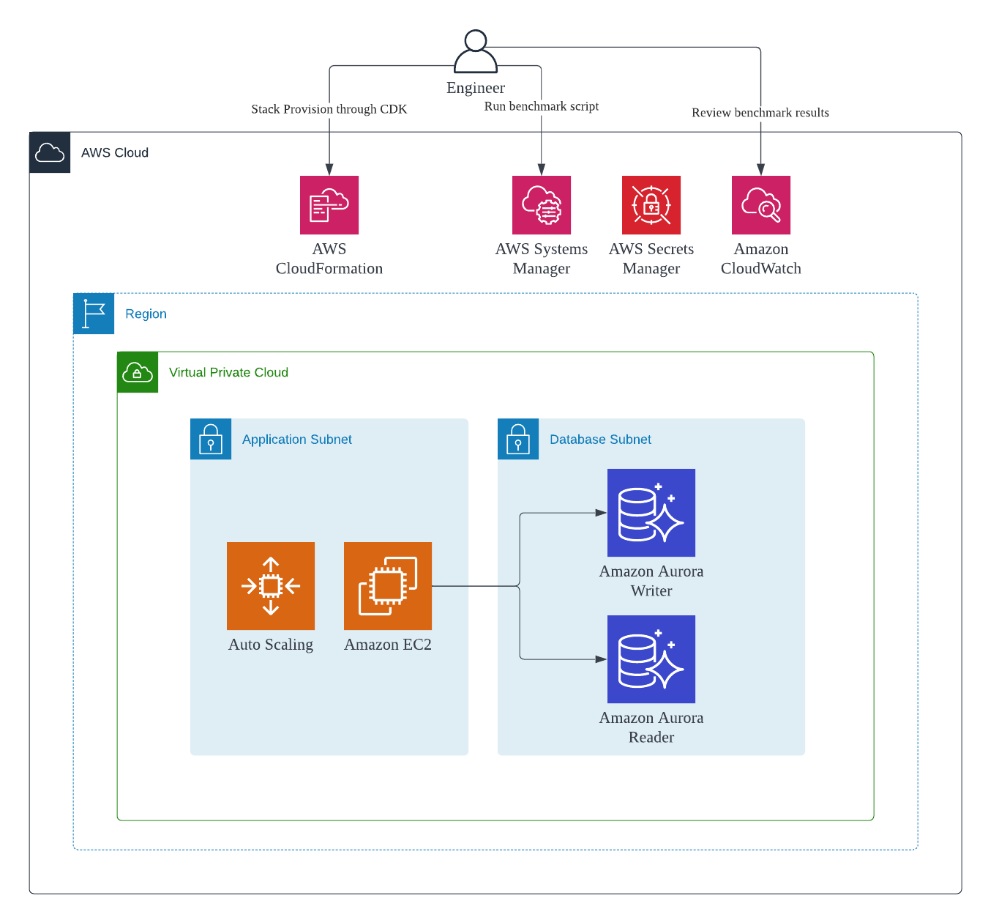

# Benchmark tests for RDS PostgreSQL and Amazon Aurora PostgreSQL
In order for Aurora to outperform RDS under the same specification, it usually takes huge effort to deploy numerous benchmarking environments to identify the optimal combination of parameters (including instance size, parameter groups, number of database connections, number of threads, query patterns etc). This CDK application demonstrates how to use a reusable architecture to setup postgresql benchmarking environment easily and cost effectively to figure out the best configuration set.

* Ephermeral by design, leaves nothing except S3 Buckets storing assets after `cdk destroy`
* No secret credentials in codebase, uses Secrets Manager to retrieve/store db credentials
* Cost effective, uses spot instance for launching benchmarking workload

## Getting started
```sh
yarn build
cdk bootstrap
cdk deploy
```

## Initialize Database
```
scripts/run_cmd.sh PgbenchInit
```

## Run benchmark
```
scripts/run_cmd.sh PgbenchTx
```

## Architecture


# Reference
* [Automate benchmark tests for Amazon Aurora PostgreSQL](https://aws.amazon.com/blogs/database/automate-benchmark-tests-for-amazon-aurora-postgresql/)
* [Aurora PostgreSQL Performance Assessment Benchmarking](https://d1.awsstatic.com/product-marketing/Aurora/RDS_Aurora_PostgreSQL_Performance_Assessment_Benchmarking_V1-0.pdf)
* [Performance Monitoring for RDS PostgreSQL and Aurora PostgreSQL](https://catalog.us-east-1.prod.workshops.aws/workshops/31babd91-aa9a-4415-8ebf-ce0a6556a216/en-US/intro)
* [Use AWS CDK to initialize Amazon RDS instances](https://aws.amazon.com/blogs/infrastructure-and-automation/use-aws-cdk-to-initialize-amazon-rds-instances/)